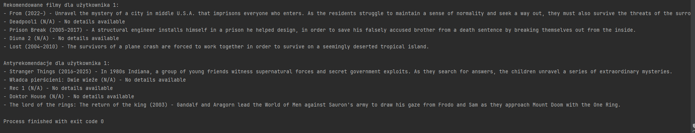

# System Rekomendacji Filmów za pomocą Klasteryzacji K-Means

Ten projekt wykorzystuje algorytm klasteryzacji K-Means do rekomendowania filmów na podstawie podobieństwa ocen użytkowników. Użytkownicy są grupowani w klastry na podstawie ich ocen filmów, a rekomendacje są generowane na podstawie ocen innych użytkowników z tego samego klastra.

## Wymagania systemowe

- Python 3.x
- `pandas` - do pracy z danymi w formacie CSV
- `scikit-learn` - do klasteryzacji użytkowników

## Instalacja zależności

Przed uruchomieniem projektu upewnij się, że masz zainstalowane wszystkie wymagane pakiety. Możesz je zainstalować, używając `pip`:

```bash
pip install pandas scikit-learn requests
```

## Pliki
Do projektu dołączone są pliki z danymi:

 * movies.csv - Plik CSV zawierający dane o filmach.
 * users.csv - Plik CSV zawierający dane o użytkownikach.
 * ratings.csv - Plik CSV zawierający oceny użytkowników.

## Sposób użycia
Aby uruchomić system rekomendacji dla określonego użytkownika, możesz użyć następującej komendy:

```bash
python movie_alghoritm.py <user_id>
```
Gdzie <user_id> to identyfikator użytkownika, dla którego chcesz uzyskać rekomendacje filmów. Na przykład:

```bash
python movie_alghoritm.py 1
```




  
