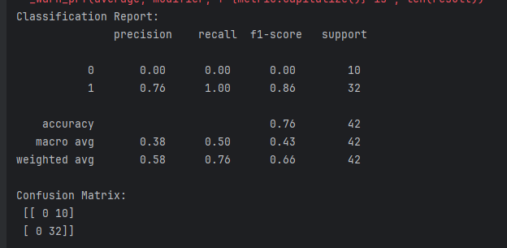
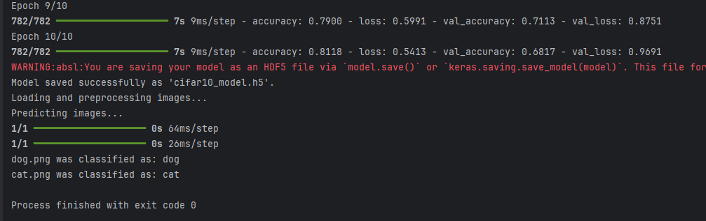
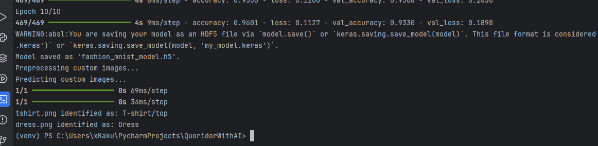

# **Machine Learning Projects: Neural Networks for Data and Image Classification**

## **Overview**
This repository contains implementations of three distinct machine learning projects utilizing neural networks for classification tasks. Each project leverages different datasets and neural network architectures to solve specific classification problems. Below is a summary of each project:

1. **Data Classification with Feedforward Neural Network**
2. **Image Classification with Convolutional Neural Network (CIFAR-10)**
3. **Image Classification with Convolutional Neural Network (Fashion-MNIST)**

---

## **Projects**

### **1. Data Classification with Feedforward Neural Network**
- **Problem**: Classify data points from a CSV file into binary categories.
- **Workflow**:
  1. Load the dataset from a CSV file.
  2. Prepare the data by extracting features and binarizing the target column.
  3. Split the data into training and test sets.
  4. Build, train, and evaluate a feedforward neural network.
- **Evaluation Metrics**: Accuracy, precision, recall, and confusion matrix.
- **File**: `ex1.py`

### **2. Image Classification with Convolutional Neural Network (CIFAR-10)**
- **Problem**: Classify images into one of 10 categories (e.g., airplane, cat, dog).
- **Dataset**: CIFAR-10 dataset, filtered for specific classes.
- **Workflow**:
  1. Load and preprocess the CIFAR-10 dataset.
  2. Build and compile a Convolutional Neural Network (CNN).
  3. Train the model and save it for future use.
  4. Preprocess custom images and classify them using the trained model.
- **Evaluation Metrics**: Accuracy during training and validation.
- **File**: `ex2.py`

### **3. Image Classification with Convolutional Neural Network (Fashion-MNIST)**
- **Problem**: Classify grayscale images of clothing items into one of 5 categories (e.g., T-shirt, Trouser).
- **Dataset**: Fashion-MNIST dataset, filtered for specific classes.
- **Workflow**:
  1. Load and preprocess the Fashion-MNIST dataset.
  2. Build and compile a Convolutional Neural Network (CNN).
  3. Train the model and save it for future use.
  4. Preprocess custom images and classify them using the trained model.
- **Evaluation Metrics**: Accuracy during training and validation.
- **File**: `ex3.py`

---

## **🛠 Dependencies**
The following Python libraries are required to run the projects:

- `pandas`
- `numpy`
- `tensorflow`
- `scikit-learn`
- `matplotlib`

### **💾 Installation**
Install dependencies with:
```bash
pip install pandas numpy tensorflow scikit-learn matplotlib
```

---

## **Usage**
To run any of the projects, execute the corresponding Python file:

```bash
python ex1.py
python ex2.py
python ex3.py
```

Ensure the necessary datasets or custom images (e.g., `dog.png`, `tshirt.png`) are available in the expected paths.

---

## **Authors**
- Adrian Stoltmann
- Kacper Tokarzewski

## **Screenshots**






